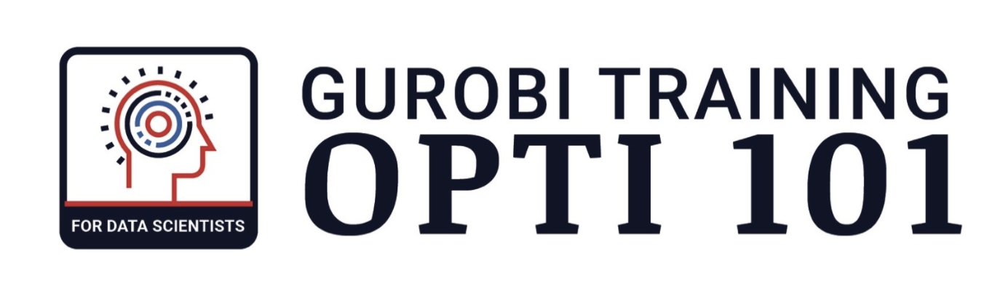

# Optimization 101 for Data Scientists!

The material is from the Webinar on [Optimization 101 for Data Scientists](https://www.gurobi.com/events/optimization-101-for-data-scientists/)
In this webinar two modeling examples and a use case were discussed. 
You can review the Jupyter Notebooks here. For all examples a completed version is available. If you want to test yourself and try out some of the exercises by yourself, you should start with the not-completed-versions of the notebooks and then compare with the completed versions.

- Resources for the first [hands-on modeling session](Modeling_Session_1)

- Resources for the **second** [hands-on modeling session](Modeling_Session_2)

- Resources for the **use case** [bike share modeling session](bike_share)

© Gurobi Optimization, LLC