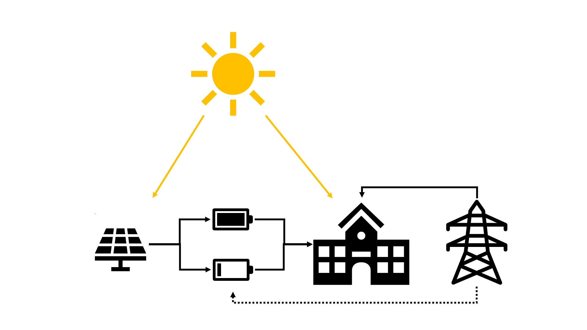

# Modeling Session 2 - Hidden Modeling Gems in Renewable Energy and Storage Optimization

## Problem
A university building is going to hold classes for a week, which requires electricity to run. and the demand for electricity changes due to the course load. There is a solar panel to provide energy and two batteries that can store it. Additionally, electricity can be purchased from the grid. The goal of the problem is to find the battery charge and discharge schedule that will:
1. Minimize the total electricity purchased from the grid.
2. Given electricity prices for each period, minimize the total cost of purchasing electricity from the grid. 

## Hidden Gems
This notebook will expand on the above problem (completed in Opti 101) by implementing these awesome capabilities:
1. Multi-objective
2. Multi-scenario
3. Solution Pool 

## Beware Spoilers!
We also put **completed** versions of the modeling2 notebook and the exercises in the repo. If you want to work through the notebooks without everything filled in, make sure not to open the completed versions.

## Notebooks links

[Google Colab Link - Modeling Session *without* answers](https://colab.research.google.com/github/Gurobi/modeling-examples/blob/master/optimization201/Modeling_Session_2/modeling2.ipynb)

[Google Colab Link - Exercise *without* answers](https://colab.research.google.com/github/Gurobi/modeling-examples/blob/master/optimization201/Modeling_Session_2/exercise_set2.ipynb)

[Google Colab Link - Modeling Session *with* answers](https://colab.research.google.com/github/Gurobi/modeling-examples/blob/master/optimization201/Modeling_Session_2/completed_modeling2.ipynb)

[Google Colab Link - Exercise *with* answers](https://colab.research.google.com/github/Gurobi/modeling-examples/blob/master/optimization201/Modeling_Session_2/completed_exercise_set2.ipynb)

----
For details on licensing or on running the notebooks, see the overview on [Modeling Examples](../../)

