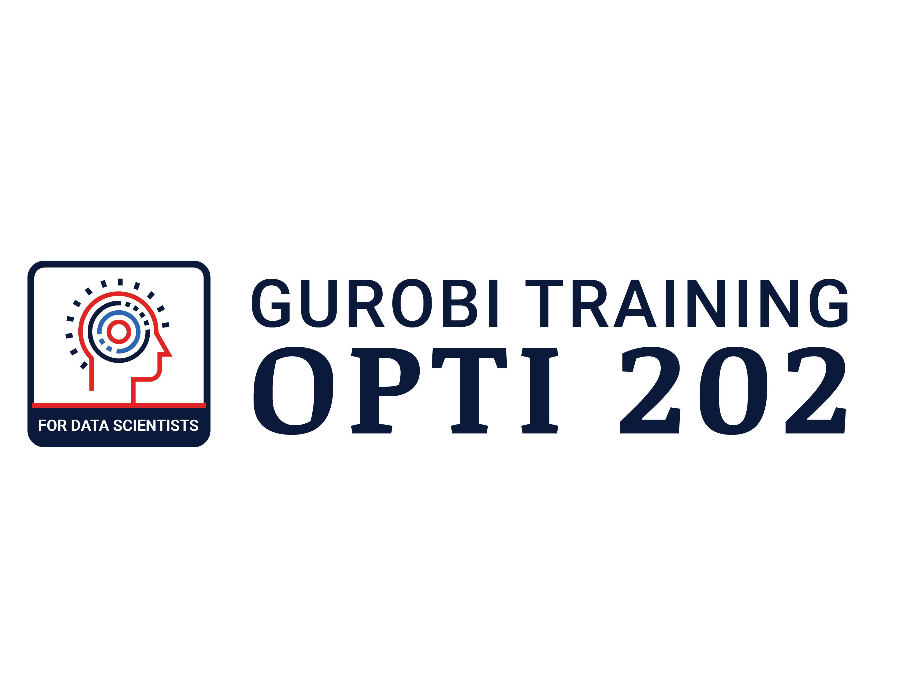

# Optimization 202 for Data Scientists!

The material is from the [Optimization 202 for Data Scientists](https://whova.com/portal/webapp/opti_202412/) training, which consists of two modeling examples and a culminating use case. 
You can review the Jupyter Notebooks here. For all examples, a completed version is available. If you want to test yourself and try out some of the exercises, you should start with the not-completed-versions of the notebooks and then compare with the completed versions.

- Resources for the **first** [hands-on exercises](Modeling_Session_1)

- Resources for the **second** [hands-on exercises](Modeling_Session_2)

- Resources for the **use case** on [emergency supply pre-positioning](ESUPS_case_study)

© Gurobi Optimization, LLC
